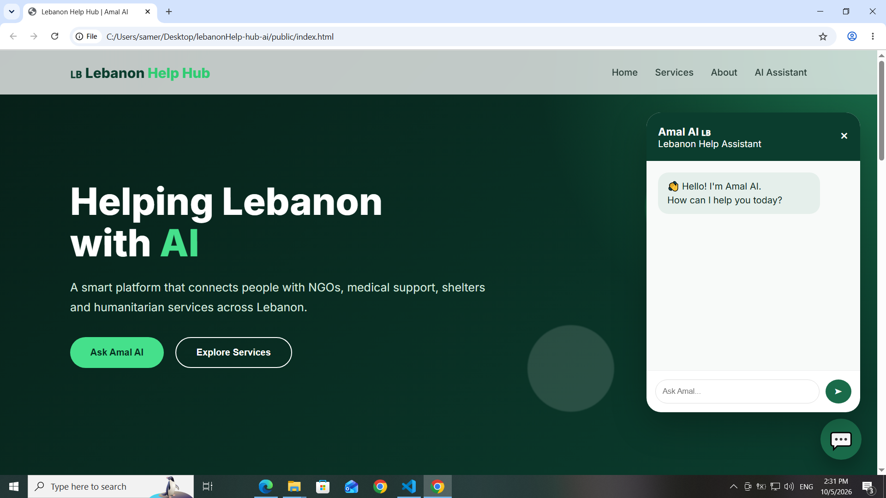
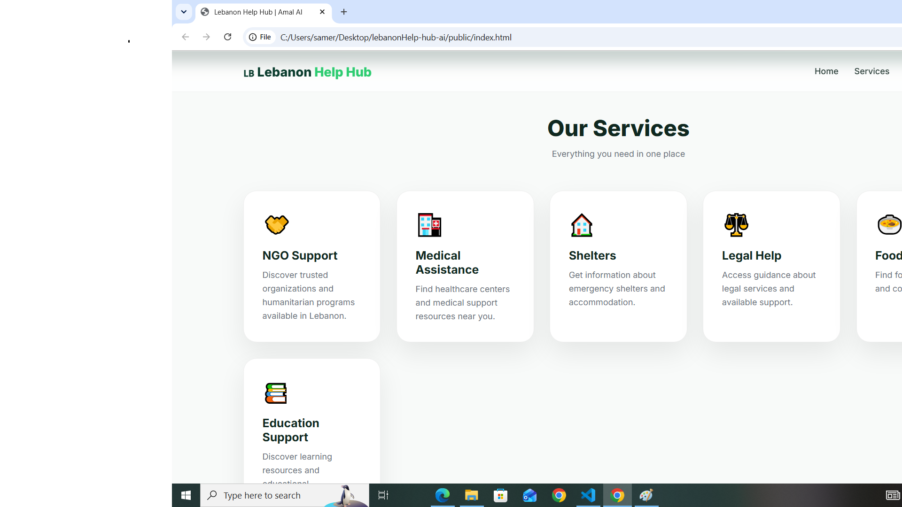
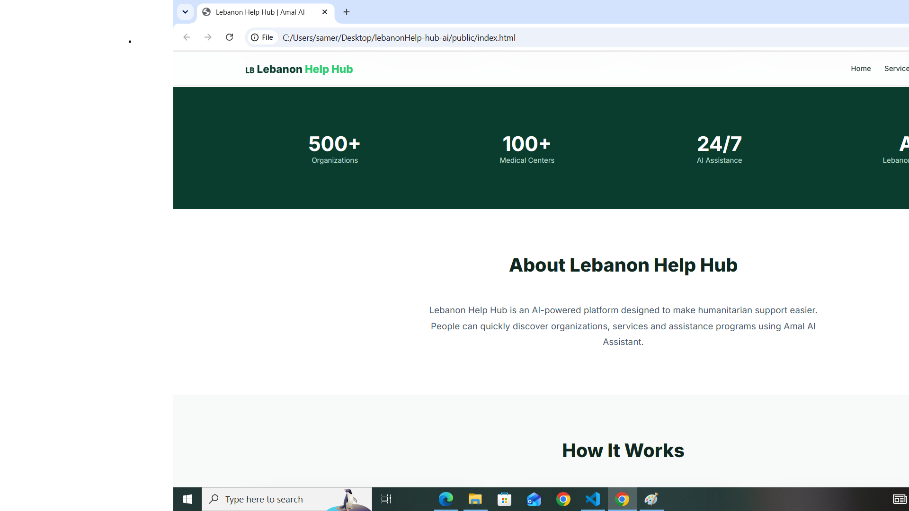
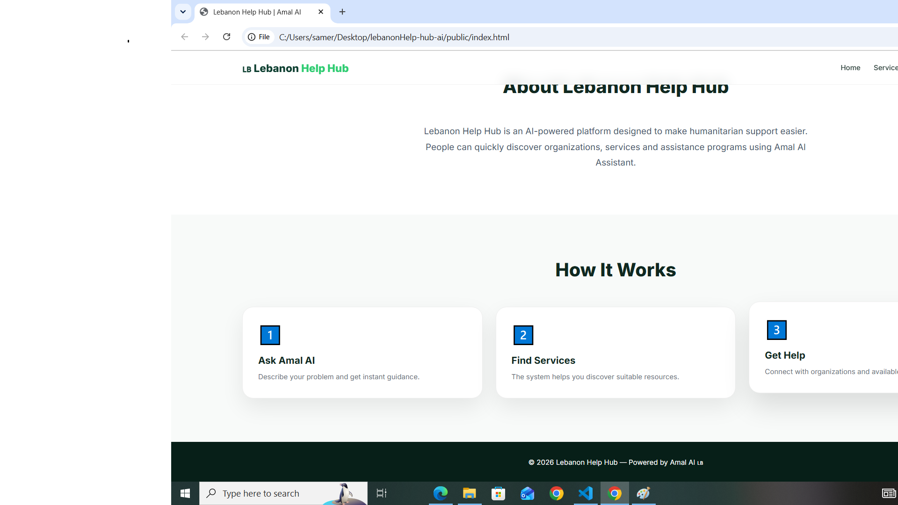

�
�🇧
 Lebanon HelpHub with Chatbot
Lebanon HelpHub is a web-based platform 
designed to provide useful information and 
assistance to users in Lebanon through a simple 
and user-friendly interface.
The project also includes an AI-powered chatbot 
that can interact with users and provide helpful 
responses using the Gemini API.
🚀
 Features
🤖
💬
🌐
📱
🇱🇧
 AI-powered chatbot
 Interactive chat interface
 Web-based user interface
 Responsive design
 Focused on information and assistance 
related to Lebanon
🔌
 Integration with the Gemini API
 Node.js backend
🖥️
�
�️
📂
 Technologies Used
HTML5
CSS3
JavaScript
Node.js
Gemini API
REST/API integration
VS Code
Git & GitHub
 Project Structure
text
lebanon-helphub-with-chatbot/
│
├── Public/
│   └── index.html
│
├── Server.js
├── package.json
│
├── Public/
│   └── index.html
│
├── Server.js
├── package.json
├── package-lock.json
├── .gitignore
└── README.md
⚙️
 Installation & Setup
1. Clone the repository
bash
git clone https://github.com/
ahmadtrabb/lebanon-helphub-with
chatbot.git
2. Open the project folder
bash
cd lebanon-helphub-with-chatbot
3. Install dependencies
bash
npm install
4. Configure the environment variables
Create a .env file in the root directory and add 
your Gemini API key:
env
GEMINI_API_KEY=your_api_key_here
Never publish your API key or commit the .env 
file to GitHub.
5. Run the project
bash
node Server.js
Then open the local address provided by the 
server in your browser.
🤖
 AI Chatbot
The chatbot uses the Gemini API to process 
user messages and generate AI-powered 
responses.
The API key is stored in an environment variable 
to keep sensitive credentials outside the source 
code.
🎯
 Project Purpose
This project was created as a practical web 
development project to demonstrate skills in:
Front-end development
JavaScript programming
Node.js
API integration
�
�‍💻
AI chatbot development
Git and GitHub
 Author
Ahmad Traboulsi
MIS Student | Web Development Enthusiast
GitHub: https://github.com/ahmadtrabb
📸
 Project Screenshots
### Screen 1

### Screen 2

### Screen 3 

### Screen 4

### Screen 5

───
⭐
 If you find this project useful, feel free to 
explore the repository.